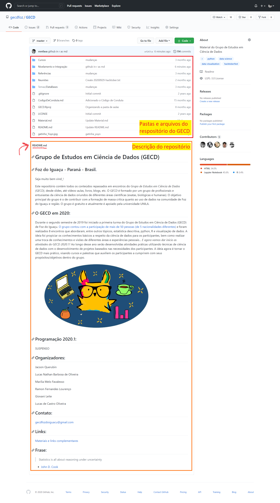
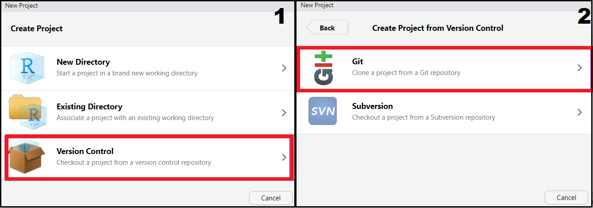
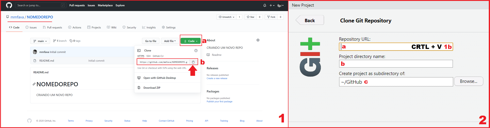
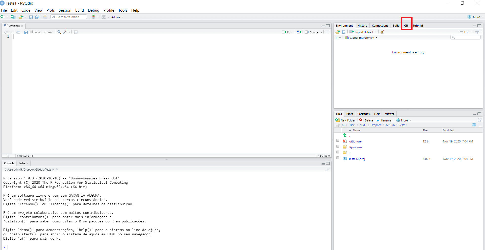
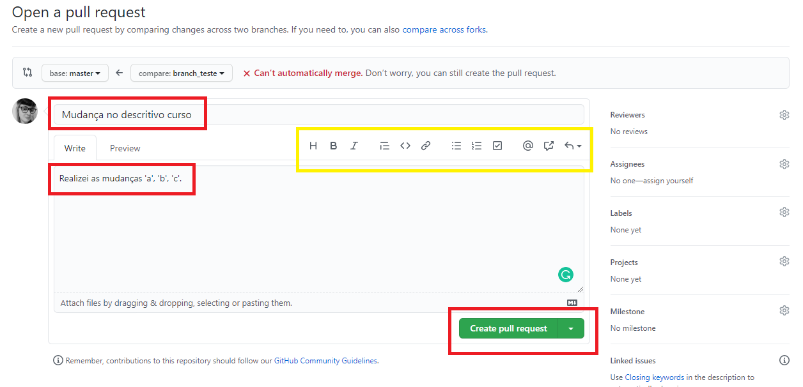
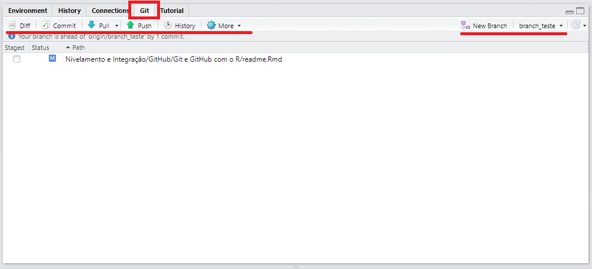

# Introdução ao Git e ao GitHub

O *Git* é um software de controle de versões que tem como objetivo gerenciar arquivos texto, principalmente códigos de programação. O funcionamento dessa ferramenta é semelhante aos sistemas de nuvens (Google Drive, Dropbox, Mega, etc), em que podemos compartilhar as edições de um script com uma equipe, além de retomar antigas versões de nossos arquivos. Resumidamente, o [*Git*](https://www.atlassian.com/br/git/tutorials/what-is-git) examina as mudanças realizadas nos arquivos de um diretório e vai guardando essas informações para compartilhar com outros usuários e/ou possibilitar a reversão de alterações realizadas. Além de ser uma ferramenta extremamente útil, o *Git* se conecta ao serviço de hospedagem e armazenamento de versões chamado [*GitHub*](https://github.com/). A partir do *GitHub* é possível contribuir com projetos de qualquer lugar do mundo, além de compartilhar os nossos próprios códigos com fins de divulgação e/ou colaboração.

A partir do *RStudio* temos algumas maneiras bem práticas de trabalhar com o *Git* e o *GitHub*, o que poderá mudar a sua vida diária nos seus trabalhos com o *R*!

{width="306"}

## Alguns exemplos

Para iniciar a familiarização com a ferramenta, que tal conhecer alguns projetos hospedados no GitHub?

1.  Temos o repositório do nosso grupo de estudos, o [GECD](https://github.com/gecdfoz/GECD).
2.  O projeto [Fio-de-Ariadne](https://github.com/cuducos/fio-de-ariadne).
3.  (...)

## Referências desse curso

"Nessa vida nada se cria, tudo se transforma". Dito isso, deixo na sequência as referências que usei para criar esse tutorial. Recomendo a leitura de cada uma!

-   Curso-R. [Rstudio e GitHub no dia-a-dia](https://www.curso-r.com/blog/2017-07-17-rstudio-e-github/).

-   Beatriz Milz. [Primeiros passos utilizando o Git e o GitHub no RStudio](https://beatrizmilz.github.io/RLadies-Git-RStudio-2019/#1).

-   TreinaWeb. [Github: Pare com as senhas e utilize Tokens de Acesso](https://www.treinaweb.com.br/blog/github-pare-com-as-senhas-e-utilize-tokens-de-acesso/).

## Pré-requisitos

-   Instalar o [R](https://cran.r-project.org/bin/windows/base/R-4.0.3-win.exe) e o [RStudio](https://rstudio.com/products/rstudio/download/) (lembre de sempre manter versões atualizadas!).

-   Fazer uma conta no [GitHub](https://github.com/). Se você é estudande, pode usar o seu e-mail institucional para obter alguns com o [GitHub Student Developer Pack](https://education.github.com/pack).

-   Instalar o [Git](https://git-scm.com/download/).

-   Instalar o pacote "[usethis](https://usethis.r-lib.org/)"

```{r eval=FALSE, include=TRUE}
install.packages("usethis")
```

## Configurando o Git

Após instalar todas as aplicações necessárias, nós vamos configurar o Git em nossas máquinas. Esse passo será feito uma única vez!

### Pelo RStudio

No RStudio você precisa escrever e executar a seguinte função com o nome e e-mail cadastrado em sua conta GitHub:

```{r eval=FALSE, include=TRUE}
usethis::use_git_config(user.name = "Marília Melo Favalesso", # Seu nome
                        user.email = "mariliabioufpr@gmail.com ") # Seu email

```

### Pelo Git

Outra possibilidade é executar essa configuração diretamente no Git em sua máquina:


## Configurando o GitHub

### Token de acesso pessoal (PAT)

Um token de acesso pessoal é uma alternativa à senha que você usaria ao acessar sua conta no serviço de hospedagem do repositório GitHub. De forma simplificada, seria uma chave com um formato semelhante a `48t979e5677b198592e5047da8a79f53bcasb4b10` que dará permissão ao RStudio acessar diretamente o seu GitHub.

A sua senha dá acesso a tudo em sua conta. Quem tiver sua senha pode apagar seus repositórios, alterar seus dados, fazer commits para qualquer repositório privado onde você possui permissões, apagar sua conta, etc. Concorda que se sua senha vazar ou se alguém tiver acesso a uma máquina onde sua senha está salva, esta pessoa terá muito poder?

Já os Tokens de Acesso te dão mais controle. Você pode criar vários e configurar as permissões que cada um vai ter. Se por algum motivo ele vazar, a sua conta continua salva. Se alguém tiver acesso a uma máquina onde seu token está salvo, a pessoa estará limitada a fazer apenas as ações que você liberou para aquele token. E com apenas um clique você pode apagar o token que quiser.

O Token de Acesso é algo simples que pode melhorar na sua segurança. Além disso, já faz um tempo que o Github vem avisando que logo desabilitará a autenticação por senha ao utilizar a linha de comando ou a API.

Para criar o token de acesso, vamos executar o comando que aparece na sequência.

```{r eval=FALSE, include=TRUE}
usethis::browse_github_token()

```

Ao executa-lo, uma página do GitHub irá abrir. Nela você poderá dar um novo para o novo token, como "Grupo de Estudos", "Projeto do R-Ladies", etc. No restante da página você poderá selecionar as permissões que quer dar para esse token. Para selecionar seus repositórios pela linha de comando, selecione o `repo`.


No final da página, ao clicar em `Generate token`, seu token será gerado e exibido para você. Copie **agora** e guarde esse número. Por motivos de segurança, assim que sair dessa página, você nunca mais verá esse token novamente. Se perder, basta criar outro.

Agora, quando for usar a linha de comando para fazer operações de Git ou quando for criar uma aplicação que usa a API do Github, basta usar esse token no lugar da sua senha. Para agilizar, já vamos incluir o token nas configurações do nosso ambiente R e deixar tudo certo para o uso.

Primeiro precisamos abrir o arquivo `.Renviron`:

```{r eval=FALSE, include=TRUE}
usethis::edit_r_environ()

```

O RStudio abrirá o arquivo como uma nova página e nele vamos precisar escrever um comando 'github\_pat' seguido pelo número do token gerado, ou seja, `GITHUB_PAT=NUMERO_DO_TOKEN`.


Após escreve-lo, pule uma linha e salve o arquivo. Na sequência, reinicie o RStudio com CTRL + SHIFT + F10.

## Criar um repositório no GitHub

Um repositório é um local (pasta/diretório) dentro de sua conta do GitHub que é feita para gerenciar um projeto. O repositório pode conter pastas, arquivos, imagens etc; enfim, tudo que o seu projeto precisar.

O GitHub sempre aconselha seus usuários a incluírem um arquivo "*README.md*" contendo todas as informações sobre o seu projeto nos repositórios criados. Esse arquivo precisa estar no formato 'md' e escrito em linguagem 'markdown'.



## Criando um repositório diretamente no GitHub

Acesse a sua conta GitHub e acesse a opção "new" na guia "repositories" (1a). Na página que aparecerá na sequência, incluir um nome para o seu repositório (2b), uma descrição (2c), determinar se o seu repositório será público ou privado (2d) e peça para o GitHub adicionar um arquivo para a descrição do seu repositório (README.md) (2e).

### 

#### Dicas:

Coloque um nome sem espaço e sem caracteres especiais no seu repositório. Quanto mais simples o nome, melhor! Por exemplo, em ver de colocar o nome "Meu respositório", colocar "meu\_repositorio".

A descrição desse repositório deve ser direta e sucinta! As informações mais detalhadas estarão no arquivo 'README.md'.

### Clonar o repositório criado no seu computador

Agora que você já criou um repositório no GitHub, é necessário clona-lo para usar no seu RStudio. Para tal, você precisa abrir o RStudio e acessar "File \> New Project".


Na aba "Create Project" (1), selecionar a opção **Version Control** e, na sequência, em "Create Project from Version Control" (2) eleger a opção **Git**.

\

Na seguida, na guia "Clone Git Repository", você precisara preencher os dados do repositório que você quer clonar. Especificamente, você precisará copiar a URL do seu repositório GitHub (1b) na guia "Repository URL" (2a). Após inserir a URL, o campo "project directory name" (2b) será preenchido automaticamente. Para finalizar, você precisa escolher um diretório - uma pasta no seu computador - para manter uma cópia local do seu repositório (2c).



O *RStudio* irá fazer o clone do repositório e abrirá um RProj para ele (caso não exista um ainda, será criado).

## Criando um repositório pelo RStudio

Você também pode criar um novo repositório pelo RStudio utilizando a função `create_package("diretorio/nome_repo")`. Com ela, você precisará fornecer um diretório e o nome do novo¹ repositório. **!!Importante não repetir nome de repositório!! Os nomes precisam ser únicos**.

Relativo ao diretório, eu tenho um padrão em meu computador chamado "GitHub" onde salvo todos os repositórios que eu trabalho.

```{r eval=FALSE, include=TRUE}
usethis::create_project("C:/Users/MMF/Dropbox/GitHub/Teste2")
```

O *RStudio* abrirá outra janela, com o novo projeto criado.

### Guia Git no RStudio

Agora que você já sabe como criar e clonar repositórios, as próximas estapas serão aprender a salvar as mudanças realizadas (*commit*) e envia-las para o seu repositório no Github (*push*). Para facilitar a nossa vida, também vamos pedir a abertura de uma guia chamada "Git" na nossa IDE.

Aqui vamos trabalhar na janela que o RStudio abriu após criar um novo projeto.



Primeiro vamos executar o comando `use_git()` do pacote usethis. O comando inicializa um repositório *Git* e adicionar arquivos importantes ao *.gitignore* (especifica arquivos intencionalmente não rastreados para ignorar). Se o usuário consentir, ele também fará um *commit* inicial.

```{r eval=FALSE, include=TRUE}
usethis::use_git(message = "Initial commit")
```

Ao realizar a ação, o programa irá perguntar se você deseja '*commitar*' (salvar) os arquivos que estão dentro da pasta correspondente ao seu repositório na sua linha do tempo de edições. Na sequência irá pedir permissão para reiniciar o RStudio con a finalidade de adicionar a guia Git na IDE. Para ambos os casos, é necessário digitar um número correspondendo a estar de acordo (ex. 1: No way, 2: Nope, 3: Absolutely).

Realizada a ação, o RStudio irá reinicializar e aparecerá a guia "Git".

### Do Git local para o GitHub

Agora que já criamos um novo projeto no Git e já salvamos os arquivos iniciais com um commit, o nosso próximo passo será criar um repositório associado ao GitHub, adicionando-o ao nosso repo local como uma *origem* remota, e então fazemos um *push* inicial para sincronizar os dois. Para tal, vamos usar o comando chamado `use_github()` do pacote *usethis*.

```{r eval=FALSE, include=TRUE}
usethis::use_github()
```

Após executar a função, duas perguntas com respostas númericas correspondentes irão aparecer. A primeira pergunta é qual protocolo git utilizar. Nesse caso, eleger a resposta 'https'. [O Git pode usar quatro protocolos distintos para transferir dados: Local, HTTP, Secure Shell (SSH) e Git](https://git-scm.com/book/en/v2/Git-on-the-Server-The-Protocols). A segunda pergunta é se o título e a descrição do repositório estão 'ok'.

### Criando um arquivo README.md

Como já falamos nessa guia, uma boa prática com o GitHub é criar arquivos 'README.md' com informações sobre o nosso respositório. Para tal, vamos usar o comando `use_readme_md()`.

```{r eval=FALSE, include=TRUE}
usethis::use_readme_md()

```

Com a execução da função, o RStudio abrirá uma nova guia para edição desse arquivo.

### Exemplo:

INCLUIR UM VÍDEO OU GIF MOSTRANDO TODO O PROCESSO.

## Como contribuir em repositórios de terceiros?

### Clone

Como o nome já diz, é literalmente clonar (ou cópiar) todo um projeto disponível no github para a sua máquina. Cópiar o projeto não possibilita editar informações no repositório original! Para isso, é necessário usar um *fork* ou um *branch*.

Para realizar a cópia do projeto para a sua máquina, é necessário utilizar a função `create_from_github()`. Para que essa função funcione, é necessário ter o PAT configurado na sua máquina.

```{r eval=FALSE, include=TRUE}
usethis::create_from_github(repo_spec = "proprietario/nome_repositorio",
                            destdir = "C:/Users/MMF/Dropbox/GitHub/nome_repo",
                            fork = FALSE)
```

Com a função 'create\_from\_github()' vamos precisar fornecer o nome do próprietario e o nome do repositório do github e o local onde vamos armazenar as informações clonadas em nossa máquina. Por exemplo, para clonar o repositório do GECD, você precisará escrever "gecdfoz/GECD" em repo\_spec.


### Fork


Uma **bifurcação** ou ***ramificação*** (em inglês: *fork*) acontece quando um/a programador/a (ou um grupo de programadores) inicia um projeto independente com base no código de um projeto já existente, ou seja, quando um software é desenvolvido com base em outro, já existente, sem a descontinuidade deste último.

Imagine que existe um repositório de um determinado software no github. Quando você clica na guia 'fork' desse repositório, você está copiando todos os dados desse repositório para a sua conta. Essa cópia continua conectada ao repositório original após isso. Se você você fizer um fork com algum projeto, irá notar uma barra informando quantos *commits* a sua *branch* está atrás ou na frente do projeto inicial. Com essa cópia em mãos, você poderá editar esse projeto com a finalidade de criar algo novo ou realizar correções com a finalidade de devolver para o desenvolvedor do projeto clonado.

A função que vamos utilizar é igual a anterior, a única diferença é que mudamos o 'FALSE' apra 'TRUE' no local que diz 'fork = '.

```{r eval=FALSE, include=TRUE}
usethis::create_from_github(repo_spec = "proprietario/nome_repositorio",
                            destdir = "C:/Users/MMF/Dropbox/GitHub/nome_repo",
                            fork = TRUE)
```

### Branch

O *branch* é um *galho da árvore de desenvolvimento*, enquanto o projeto é chamado de *trunk (tronco)*. Quando você inicia o *git init* você tem um *branch* padrão chamado *master*. O master é uma cópia do código derivado de um certo ponto do *trunk* que é utilizado para a aplicação de mudanças no código, preservando a integridade do código no *trunk*. Você sempre cria um novo branch a partir de um branch já existente.

Quando você estiver trabalhando em equipe, evite desenvolver no branch *master* pois poderá dar muitos conflitos. Sempre crie um branch para fazer suas modificações. Por exemplo, você vai desenvolver uma funcionalidade nova para listar os clientes do banco de dados e editar, você poderia criar um novo branch chamado clientes e trabalhar nesse branch para depois jogar ao master.

Se as mudanças funcionam de acordo com o planejado, elas geralmente são mescladas de volta para o tronco principal (*trunk*). Essa técnica é muito utilizada para experimentos e para desenvolvimentos paralelos.

Quando estamos fazendo um projeto em grupo, separamos várias partes desse projeto para que cada um aporte a sua contribuição. Por exemplo, se é um trabalho do colégio ou faculdade, podemos dividir a introdução, os métodos, os resultados e a discussão entre quatro pessoas. Imagine que esse determinado trabalho esteja armazenado em um repositório do GitHub, sendo possível trabalhar dentro de um arquivo entre várias pessoas. Nesse exemplo, temos o projeto principal como um trunk e cada parte desse projeto como branchs. Ao final do projeto, é possível que o criador do repositório aceite todas as partes do trabalho feitas ou apenas algumas delas.

> Aqui alguém criou um branch chamado `feature1` a partir do branch `mestre`, e você então criou um branch chamado `feature2` a partir do `feature1`. Existem pull requests abertas para ambos os branches. As setas indicam o branch base atual para cada pull request. Neste ponto, `feature1` é o branch base para `feature2`. Se a pull request para `feature2` for mesclada agora, o branch `feature2` será mesclado no `feature1`.

> 

No próximo diagrama, alguém fez merge da pull request para `feature1` no branch `mestre` , e eles excluíram o branch `feature1`. Como resultado, o GitHub redirecionou automaticamente a pull request para `feature2` para que seu branch base seja agora `mestre`.

\
Para criar um novo branch no repositório clonado, vamos usar a função pr\_init(branch = 'nome\_branch').

```{r}
usethis::pr_init(branch = "branch_teste")
```

\
Para finalizar, quando realizar suas contribuições, sempre faça commits com mensagens que deixem claro quais contribuições estão sendo realizadas.

Ao terminar de trabalhar com o código, utilize a função pr\_push() para subi-lo ao repositório.

```{r}
usethis::pr_push()
```

A página do GitHub será aberta, para que possa completar o Pull Request. Nela você terá acesso as mudanças no seu texto/código (vermelho é antes e verde depois). Você deve clicar na guia "create pull request".


Na sequência, preencha as informações sobre as mudanças realizadas. Existem diversas opções para edição de texto. Clique em "create pull request" novamente.



Após essa etapa, você deve esperar o mantenedor do repositório respondendo com o aceite do seu PR, ou com sugestões de melhoras ou mesmo o não-aceite do código. Na imagem na sequência temos o resultado final do PR.

\


Depois que o PR é aceito, temos a fusão entre as suas mudanças e o master.


## Interface gráfica no RStudio

O RStudio também oferece uma interface gráfica simples e de fácil utilização na aba "Git". Essa aba só aparecerá no seu RStudio em projetos que estejam versionados com o Git.



{width="120"}


A aba 'Status' da interface Git mostra os formatos de arquivos que queremos rastrear. A guia 'Status' vai mostrar se o arquivo será adicionado, deletado, modificado (antes -\> depois), renomeado ou se ele não entrará para ser reastreado (= .gitignore).

Antes de 'commitar' os arquivos, é importante selecionar o Branch correto. Caso você esteja iniciando a colaboração em algum projeto e ainda não possua um Branch, é só criar um novo na clicando na guia "New Branch".

Após selecionar os arquivos que queremos commitar, precisamos clicar sobre a guia 'commit'. Realizada a ação, uma nova janela ira abrir, entitutlada "RStudio: Review Changes". Nessa janela teremos algumas informações sobre as alterações que realizamos em nosso arquivo e um espaço para descrever as alterções realizadas (commit message). Você precisará descrever bem o trabalho realizado. Após a descrição, clicar sobre a guia 'commit'. Todos os arquivos selecionados para o commit devem ter desaparecido da guia *Git* no IDE RStudio. Um arquivo reaparecerá quando você salvar novas alterações.


Depois de confirmar suas alterações, você pode dar um `pull` para baixar a versão mais recente do repositório do GitHub clicando no botão `pull`. O conflito pode ocorrer durante essas etapas se várias pessoas modificaram o mesmo arquivo. Não se preocupe, o git o guiará pelas etapas necessárias para corrigir os conflitos. Este é o equivalente ao comando `git pull`.

Depois de terminar o processo de pull, você pode clicar no botão `push` para fazer upload de suas alterações para GitHub e compartilhar seu trabalho com outras pessoas. Isso é equivalente ao comando `git push`.

\
\#\#\# Colabore com esse curso! Caso você possua alguma sugestão de alteração para essa guia, sinta-se a vontade para sugerir modificações! Quem sabe esse pode ser o seu primeiro projeto colaborativo no GitHub 🌸\

## Tarefas:

-   Instale todas as ferramentas necessárias para trabalhar com o Git no RStudio.

-   Faça a configuração do seu token GitHub.

-   Crie um novo repositório diretamente do RStudio, para testar.

-   No arquivo README.md deste curso (ou seja, esse arquivo), inclua o seu nome na guia 'participantes'.

-   Caso realize alguma modificação nesse ou em outro curso do GECD, inclua o seu nome na guia 'colaboradores'.

-   Caso você encontre algum erro ou problema, [registre um issue em nosso repositório](https://github.com/gecdfoz/GECD/issues).

    \
