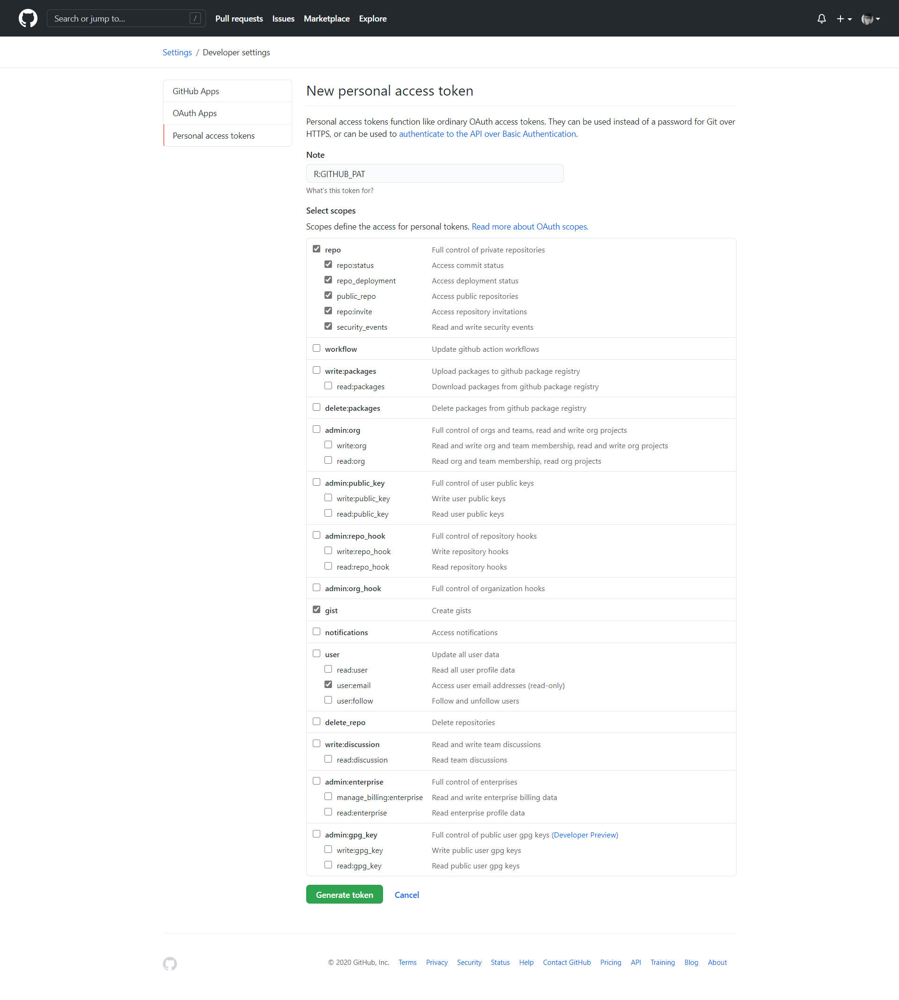

# Introdução ao Git e ao GitHub

O *Git* é um software de controle de versões que tem como objetivo gerenciar arquivos texto, principalmente códigos de programação. O funcionamento dessa ferramenta é semelhante aos sistemas de nuvens (Google Drive, Dropbox, Mega, etc), em que podemos compartilhar as edições de um script com uma equipe, além de retomar antigas versões de nossos arquivos. Resumidamente, o *Git* examina as mudanças realizadas nos arquivos de um diretório e vai guardando essas informações para compartilhar com outros usuários e/ou possibilitar a reversão de alterações realizadas. Além de ser uma ferramenta extremamente útil, o *Git* se conecta ao serviço de hospedagem e armazenamento de versões chamado *GitHub*. A partir do *GitHub* é possível contribuir com projetos de qualquer lugar do mundo, além de compartilhar os nossos próprios códigos com fins de divulgação e/ou colaboração.

A partir do *RStudio* temos algumas maneiras bem práticas de trabalhar com o *Git* e o *GitHub*, o que poderá mudar a sua vida diária nos seus trabalhos com o *R*!


## Alguns exemplos

Para iniciar a familiarização com a ferramenta, que tal conhecer alguns projetos hospedados no GitHub?

1.  Temos o repositório do nosso grupo de estudos, o [GECD](https://github.com/gecdfoz/GECD).
2.  O projeto [Fio-de-Ariadne](https://github.com/cuducos/fio-de-ariadne).
3.  (...)

## Referências desse curso

-   Curso-R. [Rstudio e GitHub no dia-a-dia](https://www.curso-r.com/blog/2017-07-17-rstudio-e-github/).

-   Beatriz Milz. [Primeiros passos utilizando o Git e o GitHub no RStudio](https://beatrizmilz.github.io/RLadies-Git-RStudio-2019/#1).

-   TreinaWeb. [Github: Pare com as senhas e utilize Tokens de Acesso](https://www.treinaweb.com.br/blog/github-pare-com-as-senhas-e-utilize-tokens-de-acesso/).

## Pré-requisitos

-   Instalar o [R](https://cran.r-project.org/bin/windows/base/R-4.0.3-win.exe) e o [RStudio](https://rstudio.com/products/rstudio/download/) (lembre de sempre manter versões atualizadas!).

-   Fazer uma conta no [GitHub](https://github.com/). Se você é estudande, pode usar o seu e-mail institucional para obter alguns com o [GitHub Student Developer Pack](https://education.github.com/pack).

-   Instalar o [Git](https://git-scm.com/download/).

-   Instalar o pacote "[usethis](https://usethis.r-lib.org/)"

```{r eval=FALSE, include=TRUE}
install.packages("usethis")
```

## Configurando o Git

Após instalar todas as aplicações necessárias, nós vamos configurar o Git em nossas máquinas. Esse passo será feito uma única vez!

### Pelo RStudio

No RStudio você precisa escrever e executar a seguinte função com o nome e e-mail cadastrado em sua conta GitHub:

```{r eval=FALSE, include=TRUE}
usethis::use_git_config(user.name = "Marília Melo Favalesso", # Seu nome
                        user.email = "mariliabioufpr@gmail.com ") # Seu email

```

### Pelo Git

Outra possibilidade é executar essa configuração diretamente no Git em sua máquina:


## Configurando o GitHub

### Token de acesso pessoal (PAT)

Um token de acesso pessoal é uma alternativa à senha que você usaria ao acessar sua conta no serviço de hospedagem do repositório GitHub. De forma simplificada, seria uma chave com um formato semelhante a `48t979e5677b198592e5047da8a79f53bcasb4b10` que dará permissão ao RStudio acessar diretamente o seu GitHub.

A sua senha dá acesso a tudo em sua conta. Quem tiver sua senha pode apagar seus repositórios, alterar seus dados, fazer commits para qualquer repositório privado onde você possui permissões, apagar sua conta, etc. Concorda que se sua senha vazar ou se alguém tiver acesso a uma máquina onde sua senha está salva, esta pessoa terá muito poder?

Já os Tokens de Acesso te dão mais controle. Você pode criar vários e configurar as permissões que cada um vai ter. Se por algum motivo ele vazar, a sua conta continua salva. Se alguém tiver acesso a uma máquina onde seu token está salvo, a pessoa estará limitada a fazer apenas as ações que você liberou para aquele token. E com apenas um clique você pode apagar o token que quiser.

O Token de Acesso é algo simples que pode melhorar na sua segurança. Além disso, já faz um tempo que o Github vem avisando que logo desabilitará a autenticação por senha ao utilizar a linha de comando ou a API.

Para criar o token de acesso, vamos executar o comando que aparece na sequência.

```{r eval=FALSE, include=TRUE}
usethis::browse_github_token()

```

Ao executa-lo, uma página do GitHub irá abrir. Nela você poderá dar um novo para o novo token, como "Grupo de Estudos", "Projeto do R-Ladies", etc. No restante da página você poderá selecionar as permissões que quer dar para esse token. Para selecionar seus repositórios pela linha de comando, selecione o `repo`.



No final da página, ao clicar em `Generate token`, seu token será gerado e exibido para você. Copie **agora** e guarde esse número. Por motivos de segurança, assim que sair dessa página, você nunca mais verá esse token novamente. Se perder, basta criar outro.

Agora, quando for usar a linha de comando para fazer operações de Git ou quando for criar uma aplicação que usa a API do Github, basta usar esse token no lugar da sua senha. Para agilizar, já vamos incluir o token nas configurações do nosso ambiente R e deixar tudo certo para o uso.

Primeiro precisamos abrir o arquivo `.Renviron`:

```{r}
usethis::edit_r_environ()

```

O RStudio abrirá o arquivo como uma nova página e nele vamos precisar escrever um comando 'github\_pat' seguido pelo número do token gerado, ou seja, `GITHUB_PAT=NUMERO_DO_TOKEN`.


Após escreve-lo, pule uma linha e salve o arquivo. Na sequência, reinicie o RStudio com CTRL + SHIFT + F10.

## Criar um repositório no GitHub

\
\
